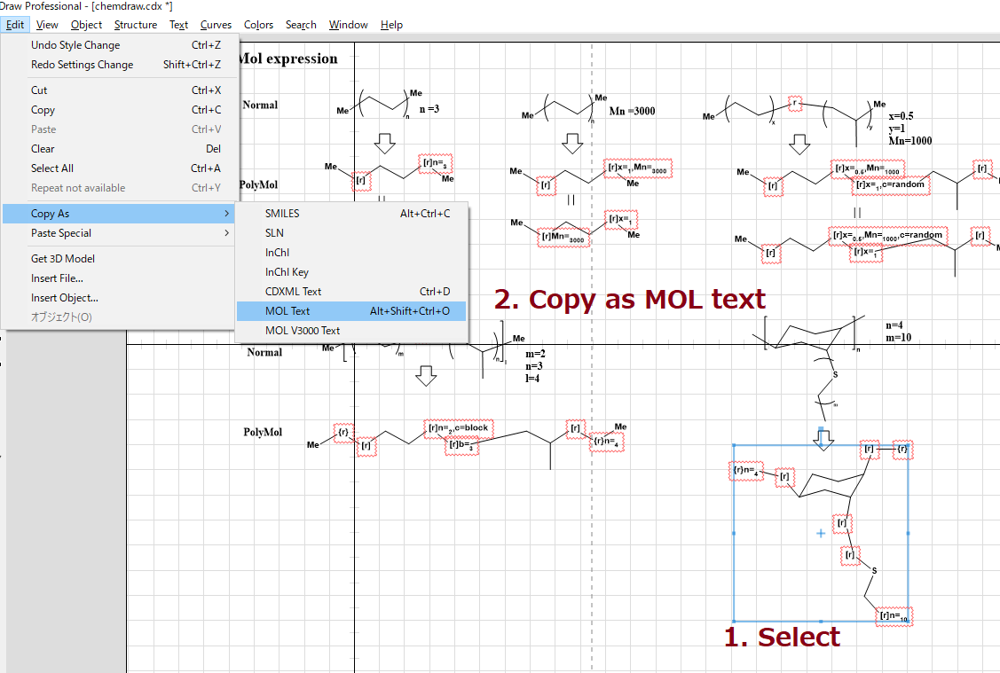

# PolyMolParser
- Parse custom polymer-compatible MOL file

# Install
- pip install git+https://github.com/KanHatakeyama/PolyMolParser.git
- RDKit and networkX are required

# Quick start 
- See Tutorial.ipynb for details

1. Prepare molecules

2. Copy as MOL text

3. Run codes
    - `
from PolyMolParser.dict_parse import parse_mol_text
`

    - `
parse_mol_text(mol_text)
`
    - (`mol_text` is string object of mol data. See https://en.wikipedia.org/wiki/Chemical_table_file)

# Todo
- Refactoring & Bug check

# History
- Prototype version 2022.2.10

# Author
- Kan Hatakeyama-Sato
- Waseda University

