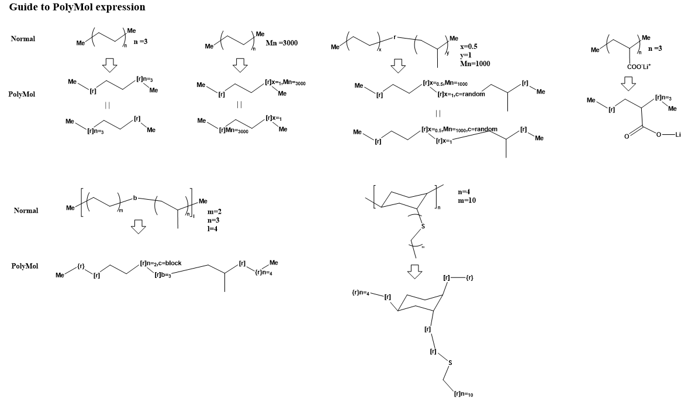

# PolyMolParser
- Parse custom polymer-compatible MOL file

# Motivation
- GUI editable, convenient recording format of polymer structures is needed for chemo-/materials-informatics

# Install
- pip install git+https://github.com/KanHatakeyama/PolyMolParser.git
- RDKit and networkX are required

# Quick start 
- See Tutorial.ipynb for details

1. Prepare molecules


2. Copy as MOL text (in the case of ChemDraw)


3. Run codes
- from PolyMolParser.dict_parse import parse_mol_text
- parse_mol_text(mol_text)
- (`mol_text` is string object of mol data. See https://en.wikipedia.org/wiki/Chemical_table_file)

4. Results
- MOL text
```
lock_test.cdx
  ChemDraw02102210232D

 15 15  0  0  0  0  0  0  0  0999 V2000
   -0.3935    1.5678    0.0000 C   0  0  0  0  0  0  0  0  0  0  0  0
   -0.8060    0.8534    0.0000 C   0  0  0  0  0  0  0  0  0  0  0  0
   -0.0128    1.0801    0.0000 C   0  0  0  0  0  0  0  0  0  0  0  0
    0.7853    0.8534    0.0000 C   0  0  0  0  0  0  0  0  0  0  0  0
    1.1979    1.5678    0.0000 C   0  0  0  0  0  0  0  0  0  0  0  0
    0.4045    1.3412    0.0000 C   0  0  0  0  0  0  0  0  0  0  0  0
   -1.3422    1.4804    0.0000 C   0  0  0  0  0  0  0  0  0  0  0  0
    1.4804    2.3430    0.0000 C   0  0  0  0  0  0  0  0  0  0  0  0
    0.6391    0.0414    0.0000 C   0  0  0  0  0  0  0  0  0  0  0  0
    0.8867   -0.9489    0.0000 C   0  0  0  0  0  0  0  0  0  0  0  0
    1.5335   -1.4610    0.0000 S   0  0  0  0  0  0  0  0  0  0  0  0
    1.2138   -2.2215    0.0000 C   0  0  0  0  0  0  0  0  0  0  0  0
    1.7638   -2.8365    0.0000 C   0  0  0  0  0  0  0  0  0  0  0  0
    2.1415    2.8365    0.0000 C   0  0  0  0  0  0  0  0  0  0  0  0
   -2.1415    1.6848    0.0000 C   0  0  0  0  0  0  0  0  0  0  0  0
  1  2  1  0      
  2  3  1  0      
  3  4  1  0      
  4  5  1  0      
  5  6  1  0      
  6  1  1  0      
  2  7  1  0      
  5  8  1  0      
  4  9  1  0      
 10 11  1  0      
 11 12  1  0      
 12 13  1  0      
  9 10  1  0      
  8 14  1  0      
  7 15  1  0      
A    7
[r]
A    8
[r]
A    9
[r]
A   10
[r]
A   13
[r]n=10
A   14
{r}
A   15
{r}n=4
M  END
```

- Parsed
```
{0: {0: {'graph': <networkx.classes.graph.Graph at 0x1f5b9862288>,
   'unit_data': {'block_info_n': '4', 'unit_info_n': 1},
   'end_groups': {},
   'unit_MW': 81.13799999999999,
   'SMILES': '*C1CCC(*)C(*)C1',
   'repeated_MW': 81.13799999999999},
  1: {'graph': <networkx.classes.graph.Graph at 0x1f5b98dc088>,
   'unit_data': {'unit_info_n': '10', 'block_info_n': 1},
   'end_groups': {},
   'unit_MW': 46.094,
   'SMILES': '*CS*',
   'repeated_MW': 460.94},
  'unit_MW': 542.078,
  'n': 4.0,
  'repeated_MW': 2168.312},
 'general': {'Mn': 2168.312,
  'Average_MW_per_unit': 197.11927272727272,
  'Average_MW_per_block': 542.078},
 'status': 'successful parsing!'}
```

    - Average molecular weight per repeating unit (or block), etc can be calculated automatically!

# Todo
- Refactoring & Bug check

# History
- Prototype version 2022.2.10

# Author
- Kan Hatakeyama-Sato
- Waseda University


